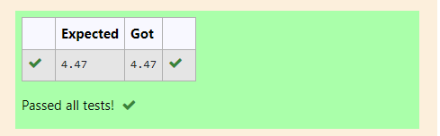

# DISTANCE-BETWEEN-TWO-POINTS

## AIM:
To write a python program to find the distance two 2 points
## ALGORITHM:
### Step 1: 
get 4 inputs from user.
### Step 2: 
classify with x1,x2 and y1,y2 points.
### Step 3: 
make points and use formula to calculate distance between 2 points
### Step 4: 
display the output.

### PROGRAM:
  ```
  x1,x2,y1,y2=10,6,4,2
import math
value=math.sqrt((x2-x1)**2+(y2-y1)**2)
print(round(value,2))
```


### OUTPUT:


### RESULT:
Thus the program to calculate distance between 2 point is done successfully.